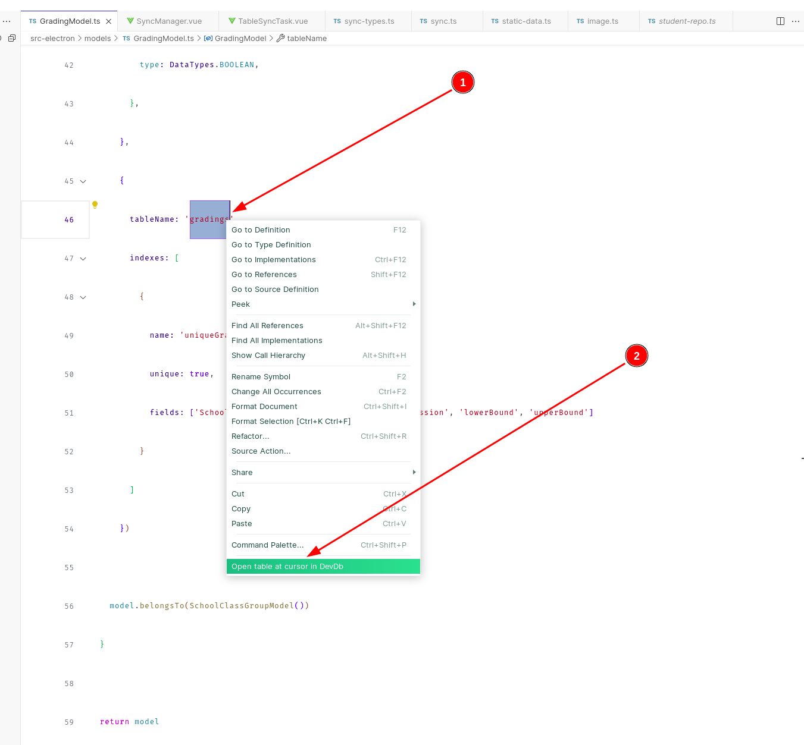

# [DevDb](https://marketplace.visualstudio.com/items?itemName=damms005.devdb)


A lightweight VS Code extension that auto-loads your database. It provides a beautiful database GUI client experience. It brings [Convention over Configuration](https://en.wikipedia.org/wiki/Convention_over_configuration) into database management.

Built with 💖 for developers.

## Requirements

- VS Code 1.83 or newer
- A VS Code project that uses any of the [supported databases](#supported-databases)

## Quick Start

- In a VS Code project using any of the [supported databases](#supported-databases), ensure your database is properly set up and you are able to connect to your database as usual from your normal app code.
- DevDb [loads your database](#loading-databases). You can view your database by opening the DevDb (usually before the Terminal tab) as shown in the screenshot below, or by using the [shortcut](#keybinding):


> [!NOTE]
> DevDb provides some [Language and Framework Integrations](#language-and-framework-integrations)

## Loading databases

DevDb can automatically load your database using connection details from your project.

### Automatic database loading (zero-config)

The following environments are currently supported:

1. Laravel with local default SQLite database
1. Laravel MySQL with default .env config
1. Containerized Laravel MySQL (Laravel Sail) with config in default .env/docker-compose.yml

### Config-base database loading

If there is no [zero-config support](#automatic-database-loading-zero-config) for your environment, then simply provide a `.devdbrc` file in the root of your project. DevDb will connect to and load your database using this configuration file.

The content of the configuration file should be a single array containing database connection objects as shown below:

#### SQLite database configuration file example

```
[
  {
    "type": "sqlite",
    "path": "/home/path/to/database.sqlite"
  }
]
```

#### MySQL database configuration file example

```
[
  {
    "name": "My test MySQL database", // <-- to identify the connection
    "type": "mysql",
    "host": "<host>",
    "port": "<port>",
    "username": "<username>",
    "password": "<password>",
    "database": "test" // <-- the database to show in VS Code DevDb view
  }
]
```

You can also have more than one connections in the configuration file, e.g.

```
[
  {
    "name": "My test MySQL database", // <-- to identify the connection
    "type": "mysql",
    "host": "<host>",
    "port": "<port>",
    "username": "<username>",
    "password": "<password>",
    "database": "test" // <-- the database to show in VS Code DevDb view
  },
  {
    "type": "sqlite",
    "path": "/home/path/to/database.sqlite"
  }
]
```

> [!TIP]
> You may not want to commit DevDb config file to your version control.
> This is because other devs in your team may be using different database connection details in their local environments.

## Keybinding

Press `Ctrl+K Ctrl+D` to bring up DevDb view

## Supported Databases

The following databases are currently supported:

- MySQL
- SQLite

Support for Postgres and MongoDB will likely be added in a future release.

## Language and Framework Integrations

- Laravel model Code Lens for viewing Eloquent model underlying table

  

- Context Menu entry for any table (framework/programming language-agnostic)

  Example from a Node JS app (a [Sequelize model definition](https://sequelize.org/docs/v6/core-concepts/model-basics/#model-definition))

  

## Why DevDb?

Two words: Better DX.

DevDb aims to be a DB GUI client specifically designed for a much better development experience when working with databases.
Specifically, these experiences:

1. For any new project, it is usually required to setup db connection in the app project, **and** then in some other DB client.
2. It is common to frequently tab-in and tab-out of project windows, switching between the IDE and DB client. Sometimes, frequent enough to want to view the DB data directly in the IDE. Think of how you've got your in-built terminal right in the IDE.

Local DX should be better than this.

Also, most of the DB clients are clunky or simply overwhelming, with bells and whistles that are not really useful during local development flow. Usually, being able to simply _view_ DB data is all that is needed during local development.

Furthermore, who doesn't love beautiful UIs? DB clients have evolved to generally not have exciting UIs in my opinion, except just a few with excellent and intuitive UIs.

To address the above, there is a need for a database GUI tool that lives in the IDE, and mostly auto-detects and connects with the database configured in the currently opened workspace. It should be simple, fast, intuitive, and clean.

Hence, DevDb 🚀

## Disclaimer

DevDb does not aim to provide feature-parity with popular GUI database clients. This extension is focused on improving the experience of working with databases during application development.
